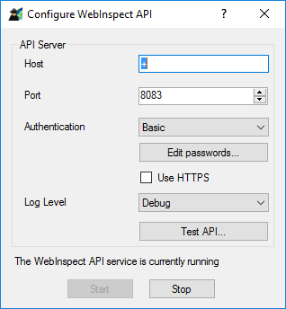

# Power Shell For WebInspect Module

## Usage

#### Table of Contents
*   [Configuration](#configuration)
*   [Scans](#scans)
    * [Retrieving Scans](#retrieving-scans)
    * [Retrieving Scan Status](#retrieving-scan-status)
    * [Starting a Dynamic Scan](#starting-a-dynamic-scan)
*   [Troubleshooting](#troubleshooting)    

----------

## Configuration

To access the [WebInspect](https://www.microfocus.com/en-us/products/webinspect-dynamic-analysis-dast/) API you will need to 
have installed WebInspect as per the [documentation](https://www.microfocus.com/documentation/fortify-webinspect/) and 
started the Windows **WebInspect API Service** either automatically or using the **Micro Focus Fortify Monitor Tool**. 
Using the Monitor tool you can configure the Authentication method to use:



Assuming you have configured **Basic** Authentication, then you can configure this module using the following:

```PowerShell
$Credential = Get-Credential
Set-WIConfig -ApiUri http://localhost:8083/webinspect -AuthMethod Basic -Credential $Credential
```

You will requested for your authentication details after the first command which will then be stored on the filesystem
for all future requests. 

The configuration is encrypted and stored on disk for use in subsequent commands.

To retrieve the current configuration execute the following:

```PowerShell
Get-WIConfig
```

There following configuration settings are available/visible:

- `Proxy` - A proxy server configuration to use
- `ApiUri` - The API endpoint of the WebInspect API you are using
- `AuthMethod` - The authentication method being used
- `Credential` - A PowerShell Credential object
- `ForceVerbose` - Force Verbose output for all commands and subcommands 

Each of these options can be set via `Set-WIConfig`, for example `Set-WIConfig -ForceVerbose` to force
verbose output in commands and sub-commands.

----------

## Scans

### Retrieving Scans

### Retrieving Scan Status

### Starting a Dynamic Scan

...

----------

## Troubleshooting

### Untrusted Repository

If this is the first time you have installed a module from [PSGallery](https://www.powershellgallery.com/), you might receive a message similar to the
following:

```
Untrusted repository
You are installing the modules from an untrusted repository. If you trust this repository, change its
InstallationPolicy value by running the Set-PSRepository cmdlet. Are you sure you want to install the modules from
'PSGallery'?
[Y] Yes  [A] Yes to All  [N] No  [L] No to All  [S] Suspend  [?] Help (default is "N"): Y
```

Select `Y` to install the module this time or you can use `Set-PSRepository` cmdlet.

### Removing/creating the configuration file

The configuration file is stored in `%HOME_DRIVE%%HOME_PATH%\AppData\Local\Temp`, e.g. `C:\Users\demo\AppData\Local\Temp`
as `%USERNAME%-hostname-PS4WI.xml`. You can delete this file and re-create it using `Set-WIConfig` if necessary.

### Debugging responses

If you are not receiving the output you expect you can turn on **verbose** output using the `ForceVerbose` option
as in the following:

```Powershell
Set-WIConfig -ForceVerbose $true
```

Then when you execute a command you should see details of all the API calls that are being made.
